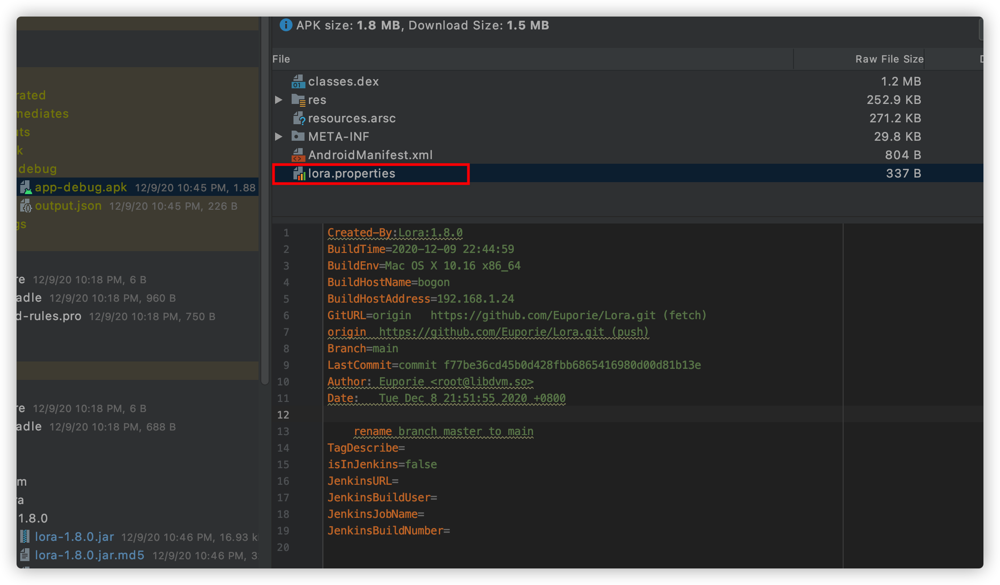

[中文](./README_CN.md)
# Lora
A plugin library that adds compile-time environment information to the generated APK file.

## Screenshots


## Usage
First, in root project's `build.gradle` file, add maven in `buildscript` block as follow:
```
maven{ url 'https://raw.githubusercontent.com/Euporie/Lora/main/repo/'}
```
and add dependencies in `dependencies` block as follow:
```
classpath 'so.libdvm:lora:1.8.0'
```
Then, in application module's `build.gradle` file, add usage in the beginning as follow:
```
apply plugin: 'so.libdvm.lora'
```
When build finished, you will find `lora.properties` file in apk file's root directory, it contains compile-time environment information.
## License
    Copyright (C) 2020, Zhang Chen
    
    Licensed under the Apache License, Version 2.0 (the "License");
    you may not use this file except in compliance with the License.
    You may obtain a copy of the License at
    
       http://www.apache.org/licenses/LICENSE-2.0
    
    Unless required by applicable law or agreed to in writing, software
    distributed under the License is distributed on an "AS IS" BASIS,
    WITHOUT WARRANTIES OR CONDITIONS OF ANY KIND, either express or implied.
    See the License for the specific language governing permissions and
    limitations under the License.