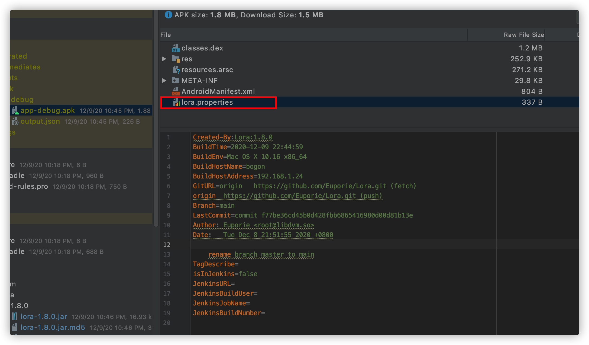

[English](./README.md)

# Lora
一个在生成的APK文件中添加编译时环境信息的插件库。

## 截图


## 使用
首先，在项目根目录的`build.gradle`文件中，在`buildscript`代码块添加如下maven：
```
maven{ url 'https://raw.githubusercontent.com/Euporie/Lora/main/repo/'}
```
在`dependencies`代码块添加如下依赖：
```
classpath 'so.libdvm:lora:1.8.0'
```
然后，在application module的`build.gradle`文件开头，添加如下代码：
```
apply plugin: 'so.libdvm.lora'
```

## License
    Copyright (C) 2020, Zhang Chen
    
    Licensed under the Apache License, Version 2.0 (the "License");
    you may not use this file except in compliance with the License.
    You may obtain a copy of the License at
    
       http://www.apache.org/licenses/LICENSE-2.0
    
    Unless required by applicable law or agreed to in writing, software
    distributed under the License is distributed on an "AS IS" BASIS,
    WITHOUT WARRANTIES OR CONDITIONS OF ANY KIND, either express or implied.
    See the License for the specific language governing permissions and
    limitations under the License.